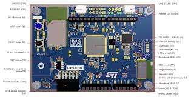
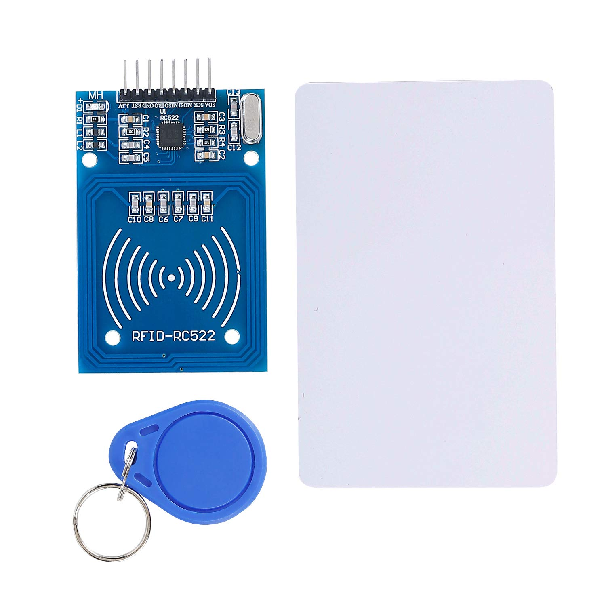
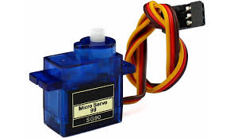
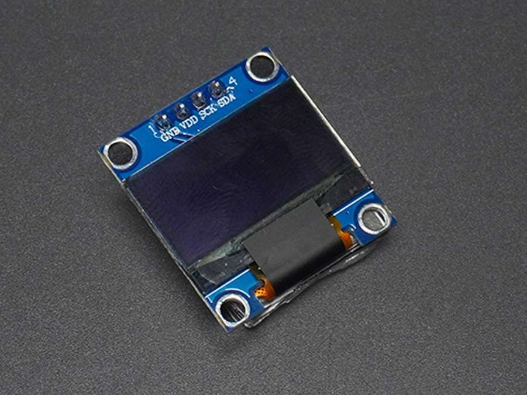

# STM32 Related work
## 【基本資料】
作業: Embed Finale Project  
姓名: 林育新  邱士倫  
學號: R12631070 B09901036  
GitHub: https://github.com/allenCHIUtw/Embed_finale
## 【實驗題目】
  
<h3> 嵌入式系統 車牌辨識停車管理系統 </h3>


##  【實驗器材】
  
|    |
| :-------------------------: |
| *stm32* |

|    |
| :-------------------------: |
| *rfid rc522 spi* |

|    |
| :-------------------------: |
| *SG90 servo* |

|    |
| :-------------------------: |
| *ssd1306 oled i2c* |


## 【實驗步驟(環境設置)】
### stm32 部分 :
1. new mbed-os-example-sockets on mbed studio
2. git clone  https://github.com/allenCHIUtw/Embed_finale.git
3. 將main.cpp複製
4. 複製 RC522 以及 Adafruit_OLED 資料夾
5. 必要時修改mbed_app.json 中的 
   ```
    "hostname": {
            "help": "The demo will try to connect to this web address on port 80 (or port 443 when using tls).",
            "value": "\"172.20.10.3\""
        },
        ..........................
        "target_overrides": {
        "*": {
            "nsapi.default-wifi-security": "WPA_WPA2",
            "nsapi.default-wifi-ssid": "\"YOURSSID\"",
            "nsapi.default-wifi-password": "\"YORPASSWORD\"",
            "platform.stdio-baud-rate": 9600,
            "mbed-trace.enable": false,
            "mbed-trace.max-level": "TRACE_LEVEL_DEBUG",
            "rtos.main-thread-stack-size": 8192
        },
   ```

## 【實驗圖片集】
網址:https://drive.google.com/drive/folders/1aYixpHO7C6Fz23jzy-IdXMyKOYIpHxc6